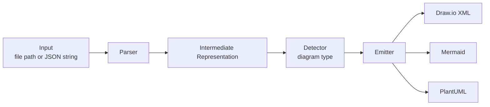
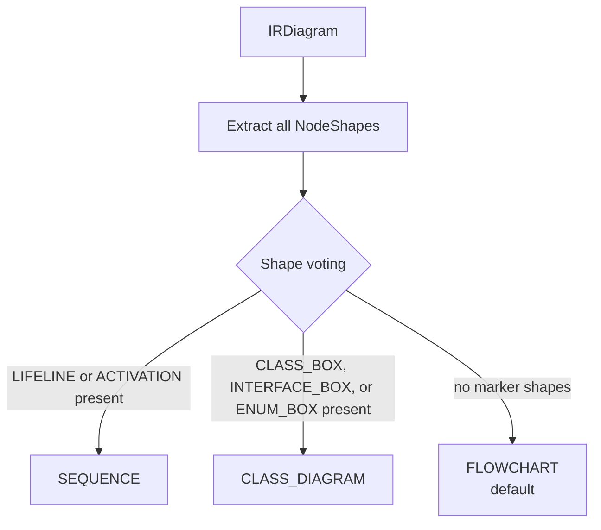
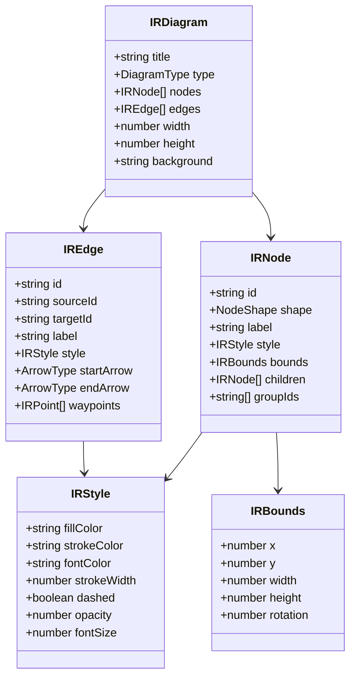

# Architecture

## Pipeline Overview

`dex` converts Gliffy diagrams through a 3-stage pipeline:



Each stage is independent. The IR is the contract between stages — no Gliffy-specific details leak past the Parser.

---

## Stage 1: Parser

**Input:** Raw Gliffy JSON string
**Output:** `IRDiagram`

The parser operates in two passes:

1. **Pass 1 — Shapes → Nodes:** Iterates all objects with a `graphic` field. Maps Gliffy UIDs (e.g. `com.gliffy.shape.flowchart.flowchart_v1.default.decision`) to `NodeShape` enum values via `shape-map.ts`. Extracts plain-text labels by stripping HTML tags from child text objects.

2. **Pass 2 — Lines → Edges:** Iterates objects with `graphic.type === 'Line'`. Resolves `constraints.startConstraint.nodeId` / `endConstraint.nodeId` to `IREdge.sourceId` / `targetId`. Maps `controlPath` coordinates to absolute `IRPoint` waypoints.

**Key files:**

| File | Responsibility |
|---|---|
| `src/parser/parser.ts` | Two-pass parser entry point |
| `src/parser/shape-map.ts` | Gliffy UID → `NodeShape` lookup table |
| `src/parser/label-extractor.ts` | HTML tag stripping |
| `src/parser/gliffy-types.ts` | TypeScript interfaces for raw Gliffy JSON |

---

## Stage 2: Detector

**Input:** `IRDiagram`
**Output:** `DiagramType`

Classifies the diagram by scoring node shapes against known categories:



SEQUENCE and CLASS_DIAGRAM are detected by the presence of marker shapes. FLOWCHART is the unconditional fallback.

**Key file:** `src/detector/detector.ts`

---

## Stage 3: Emitters

**Input:** `IRDiagram` (with `type` set)
**Output:** String (XML or diagram text)

All three emitters implement the same interface:

```typescript
interface Emitter {
  emit(diagram: IRDiagram): string
}
```

### DrawioEmitter

- Generates `<mxGraphModel>` XML with `<mxCell>` nodes and edges
- Passes `IRBounds` directly to `mxGeometry` (full spatial fidelity)
- Builds semicolon-delimited style strings from `IRStyle`
- Edge waypoints → `<Array as="points"><mxPoint .../></Array>`
- Node/edge IDs prefixed with `s` to avoid collision with reserved root cells `0` and `1`

### MermaidEmitter

- Dispatches by `DiagramType` to `emitFlowchart`, `emitSequence`, or `emitClassDiagram`
- Maps `NodeShape` to bracket syntax: `DIAMOND` → `{label}`, `CIRCLE` → `((label))`, etc.
- Sanitises node IDs (prefixed with `n`, special chars replaced with `_`)
- Layout coordinates are discarded — Mermaid handles layout automatically

### PlantUMLEmitter

- Dispatches by `DiagramType`
- Class diagram nodes declared as `class "Label" as nId` for alias-based edge references
- Uses `skinparam` blocks for style hints

**Key files:**

| File | Responsibility |
|---|---|
| `src/emitters/drawio.ts` | IR → Draw.io XML |
| `src/emitters/mermaid.ts` | IR → Mermaid |
| `src/emitters/plantuml.ts` | IR → PlantUML |
| `src/emitters/helpers.ts` | `sanitizeId`, `sanitizeLabel` shared utilities |

---

## Intermediate Representation (IR)

The IR is a typed graph model. All Gliffy-specific details are fully resolved during parsing.



**Enums:**

| Enum | Values |
|---|---|
| `DiagramType` | `FLOWCHART`, `SEQUENCE`, `CLASS_DIAGRAM`, `UNKNOWN` |
| `NodeShape` | `RECTANGLE`, `DIAMOND`, `CIRCLE`, `CYLINDER`, `PARALLELOGRAM`, `TERMINAL`, `DOCUMENT`, `ACTOR`, `LIFELINE`, `ACTIVATION`, `CLASS_BOX`, `INTERFACE_BOX`, `ENUM_BOX` |
| `ArrowType` | `NONE`, `OPEN`, `FILLED` |

**Key file:** `src/ir/types.ts`
