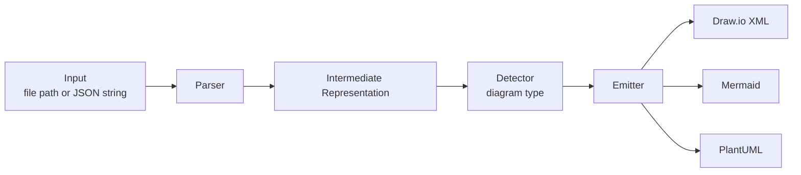
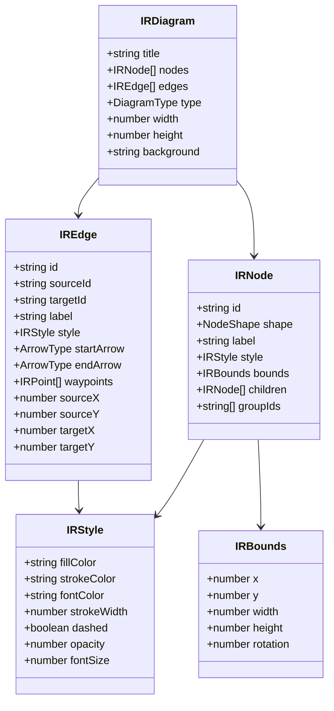
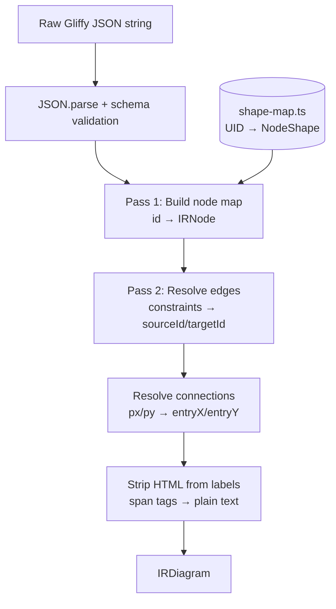
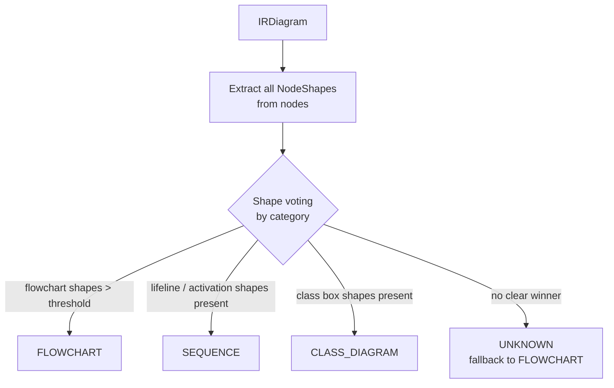
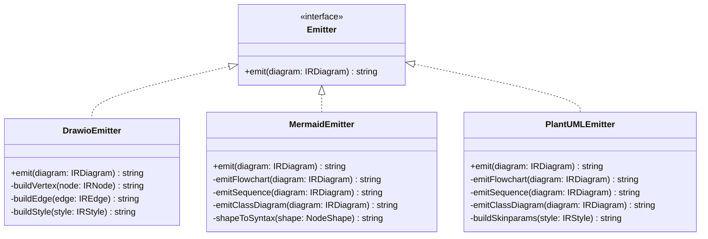
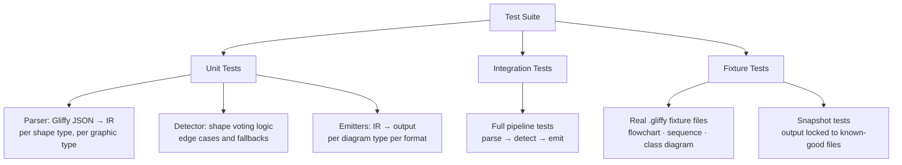

# dex — Gliffy Diagram Conversion Library: Design Document

**Date:** 2026-03-17
**Status:** Validated

---

## Overview

`dex` (diagram-exporter) is a TypeScript library and CLI tool that converts Gliffy `.gliffy` diagram files into Draw.io XML, Mermaid, and PlantUML formats. It accepts either a local file path or a raw Gliffy JSON string as input.

---

## Decisions Log

| Decision | Choice | Rationale |
|---|---|---|
| Language | TypeScript/Node.js | Runs in browser and Node; ecosystem alignment with `convert2mermaid` |
| Delivery | NPM library + CLI (`dex`) | Library for programmatic use; CLI for one-off conversions at no extra cost |
| Output formats (v1) | Draw.io XML, Mermaid, PlantUML | Visio deferred; these three cover the primary use cases |
| Diagram types (text targets) | Flowchart, Sequence, Class Diagram | Covers ~80% of real-world Gliffy files; extensible via IR |
| Input | File path or raw JSON string | Composable API; no filesystem dependency for library consumers |

---

## Architecture

The library follows a 3-stage pipeline:



---

## Package Structure

```
src/
  parser/         # Gliffy JSON → IR
  ir/             # IR type definitions
  detector/       # Diagram type inference from shape UIDs
  emitters/
    drawio.ts     # IR → Draw.io XML
    mermaid.ts    # IR → Mermaid text
    plantuml.ts   # IR → PlantUML text
  cli.ts          # CLI entry point (commander.js)
  index.ts        # Public library API

tests/
  fixtures/       # Sample .gliffy files (flowchart, sequence, class)
  parser/
  emitters/

dist/             # Compiled output
docs/
  plans/          # Design documents
```

---

## Intermediate Representation (IR)

The IR is a typed graph model that decouples parsing from emission. All Gliffy-specific details (UIDs, px/py constraints, controlPath) are fully resolved during parsing — nothing Gliffy-specific leaks into the IR.



**Key enums:**

- `DiagramType`: `FLOWCHART | SEQUENCE | CLASS_DIAGRAM | UNKNOWN`
- `NodeShape`: `RECTANGLE | DIAMOND | CIRCLE | CYLINDER | PARALLELOGRAM | TERMINAL | DOCUMENT | ACTOR | LIFELINE | CLASS_BOX | INTERFACE_BOX | ENUM_BOX | ...`

---

## Parser Layer

Transforms raw Gliffy JSON into the IR in two passes:



**Key responsibilities:**

- **Shape UID mapping** (`shape-map.ts`): static lookup table mapping Gliffy UIDs (e.g. `com.gliffy.shape.flowchart.flowchart_v1.default.decision`) → `NodeShape.DIAMOND`. Ported from draw.io's `gliffyTranslation.properties`.
- **Label extraction**: strips HTML tags, extracts plain text and basic style hints (font size, bold, color).
- **Connection resolution**: `constraints.startConstraint.nodeId` → `IREdge.sourceId`; `px`/`py` values → normalised `sourceX`/`sourceY` (0.0–1.0).

**Entry point:**
```typescript
parse(input: string | GliffyJSON): IRDiagram
```

---

## Detector Layer

Classifies the diagram type by scoring node shapes against known categories:



**Category scoring table:**

| Category | Triggering shapes |
|---|---|
| `FLOWCHART` | `PROCESS`, `DECISION`, `TERMINAL`, `DOCUMENT`, `CYLINDER`, `PARALLELOGRAM` |
| `SEQUENCE` | `LIFELINE`, `ACTIVATION`, `ACTOR` |
| `CLASS_DIAGRAM` | `CLASS_BOX`, `INTERFACE_BOX`, `ENUM_BOX` |

Fallback to `FLOWCHART` when no category scores above minimum threshold (2 nodes).

**Entry point:**
```typescript
detect(diagram: IRDiagram): DiagramType
```

---

## Emitters

All three emitters implement a common interface:



**Per-emitter responsibilities:**

- **DrawioEmitter**: Direct coordinate passthrough (`IRBounds` → `mxGeometry`), style string construction, waypoints → `<Array as="points">`. Full spatial fidelity preserved.
- **MermaidEmitter**: Dispatches by `DiagramType`. Maps `NodeShape` to bracket syntax (`DIAMOND` → `{label}`, `CIRCLE` → `((label))`). Layout discarded.
- **PlantUMLEmitter**: Same dispatch pattern. Uses `skinparam` for style hints. Derives direction hints from `IRBounds` spatial relationships.

---

## Public API

```typescript
convert(
  input: string,
  format: 'drawio' | 'mermaid' | 'plantuml',
  options?: ConvertOptions
): ConvertResult

interface ConvertOptions {
  diagramType?: DiagramType  // override auto-detection
  stripStyles?: boolean      // emit topology only, no colors/fonts
}

interface ConvertResult {
  output: string             // converted diagram text or XML
  format: OutputFormat
  detectedType: DiagramType
  warnings: string[]         // e.g. "3 shapes could not be mapped"
}
```

---

## CLI

```
dex <input> [options]

Arguments:
  input                   Path to .gliffy file or - for stdin

Options:
  -f, --format <format>   Output format: drawio | mermaid | plantuml
  -o, --output <file>     Output file (default: stdout)
  -t, --type <type>       Override diagram type detection
  --no-styles             Strip styles from output
  -h, --help
```

**Examples:**
```bash
dex diagram.gliffy -f mermaid -o diagram.md
cat diagram.gliffy | dex - -f drawio > diagram.xml
dex diagram.gliffy -f plantuml --no-styles
```

---

## Testing Strategy



**Stack:** `vitest` + snapshot testing.

**Key unit test cases:**

| Layer | Test case |
|---|---|
| Parser | Unknown UID falls back to `RECTANGLE` without throwing |
| Parser | HTML label `<b>Hello</b>` → plain text `Hello` |
| Detector | Mixed shapes → majority wins |
| Detector | 1-node diagram → falls back to `FLOWCHART` |
| Mermaid | `DECISION` node → `{label}` syntax |
| Draw.io | Edge waypoints → `<Array as="points">` |
